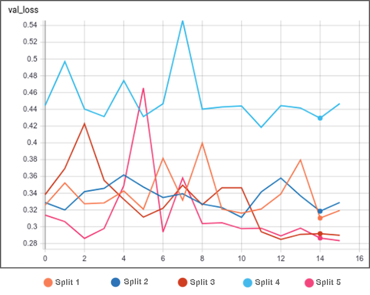
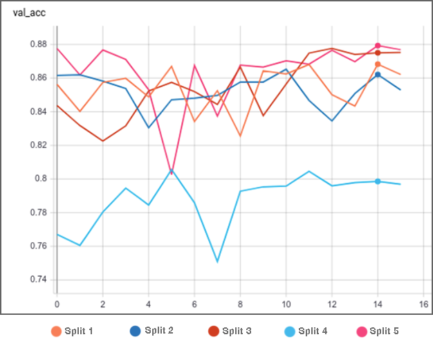
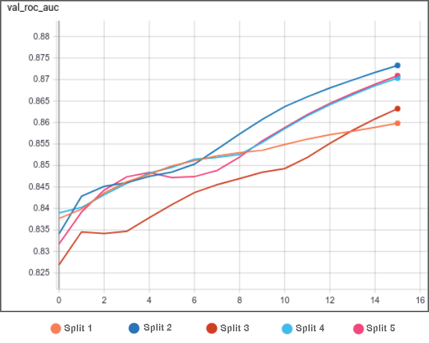

# xRayAID

## Overview
This repository exposes the final year computer engineering undergraduate project called xRayAID

The xRayAID is a classification tool capable of receiving frontal thorax radiography to speed up the diagnosis of pneumonia using machine learning. That was done by using a slightly modified DenseNet-121 network architecture trained on the Radiological Society of North America (RSNA) public dataset. The results showed that this tool is able to help doctors to identify pneumonia scenarios, achieving a validation accuracy of 87.9%.

## Hardware and Plataform Used
* Intel Core i7-3930k, 6 Cores 12 Threads
* 32 GB 1600MhZ RAM
* 1 x NVIDIA GeForce RTX 2070

## Platform and Software
* Ubuntu 18.04 LTS
* Python 3.5.4 (training)
* Python 3.8 (inference/API)

## Instalation and More Info
Each of the subfolders on this repository contains a README file explaining all the steps.

## Results

### Validation Loss

### Validtion Accuracy

### Validation ROC AUC

## Contact
If you have any quesions, please post it on github issues or email at vinicius_trev@hotmail.com

Also, if you use any of this work, please, cite me.